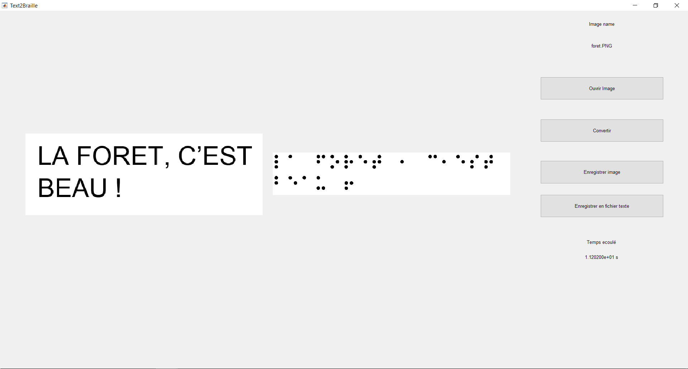

# Text2Braille
### Instructions
1. Lancer le fichier Text2Braille.m
2. Cliquer sur `Ouvrir Image` puis choisir une imae de texte (dossier `Images de textes`)
3. Cliquer sur `Convertir`
4. Vous pouvez enregistrer l'image braille et également le texte retranscrit de l'image au format txt.

### Interface

### Conversion

#### Exemple de résultats
##### Résultat 1

##### Résultat 2

